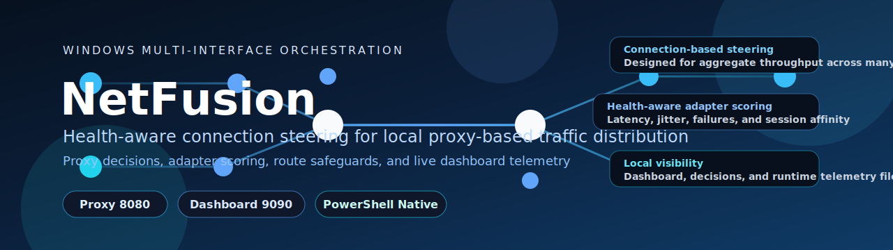
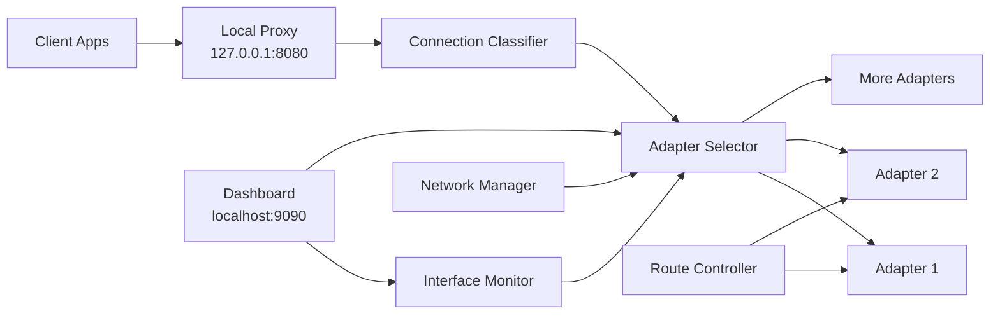

<div align="center">



<h1>NetFusion</h1>

<p><strong>Windows multi-interface traffic orchestration for high-concurrency workloads</strong></p>

<p>PowerShell-native connection steering with health-aware adapter selection, route-aware safety controls, and local dashboard telemetry.</p>

[](https://github.com/LoRdGrIm2035)
[](./LICENSE)
[](https://github.com/LoRdGrIm2035/NetFusion/commits)
[](https://github.com/LoRdGrIm2035/NetFusion)
[](https://github.com/LoRdGrIm2035/NetFusion)
[](https://www.microsoft.com/windows)
[](https://learn.microsoft.com/powershell/)
[](#quick-start)
[](#quick-start)

[](#overview)
[](#requirements--safety)
[](#architecture)
[](#quick-start)
[](#command-center)
[](#traffic-profiles)
[](#validation)
[](#troubleshooting)
[](#author)
[](#license)

</div>

---

## Overview

NetFusion is a local Windows traffic orchestrator written in PowerShell. It runs a local HTTP/HTTPS proxy, monitors multiple adapters, scores their health, and binds each new outbound connection to the interface that currently offers the best path.

This project is designed for real aggregate throughput on workloads that already use many parallel TCP connections. It helps spread those connections across multiple adapters without pretending to be true packet-level bonding.

> [!IMPORTANT]
> NetFusion is connection-based, not packet-bonded. It can improve aggregate throughput across many flows, but it does not split one TCP stream across multiple adapters.

> [!TIP]
> The best proof of value is a segmented downloader, torrent client, or any workload that opens many concurrent TCP sessions. A single browser download is usually the wrong benchmark.

> [!NOTE]
> NetFusion is designed for dynamic multi-adapter operation and does not impose a two-adapter limit. Any number of active, healthy, routable adapters can participate.

<table>
  <tr>
    <td width="33%" valign="top">
      
      <p>Each outbound connection is classified and assigned to an adapter using live health and load signals.</p>
    </td>
    <td width="33%" valign="top">
      
      <p>Adapter selection is influenced by latency, jitter, degradation trends, retry behavior, and observed activity.</p>
    </td>
    <td width="33%" valign="top">
      
      <p>Runtime behavior is exposed through dashboard views and generated state files for validation and troubleshooting.</p>
    </td>
  </tr>
</table>

## Platform Snapshot

| Capability | Value |
| --- | --- |
| Platform | Windows 10 or Windows 11 |
| Runtime | PowerShell 5.1 or newer |
| Local proxy | `127.0.0.1:8080` |
| Dashboard | `http://localhost:9090` |
| Privileges | Administrator required for route, firewall, proxy, and interface metric changes |
| Best workloads | IDM, `aria2`, torrent clients, multi-request downloaders, parallel API fetchers |
| Runtime config | [`config/config.default.json`](./config/config.default.json) |

## Multi-Adapter Support

NetFusion is designed around multi-adapter traffic steering with dynamic N-adapter handling.

Currently documented use cases:

- Mixed media: `Wi-Fi`, `Ethernet`, `USB-Wi-Fi`, `USB-Ethernet`, `Cellular`
- Any adapter count where Windows exposes usable addresses and routes

Scope notes:

- NetFusion schedules per connection; one TCP stream still maps to one adapter at a time.
- Combined speed depends on workload concurrency and upstream path diversity.

> [!IMPORTANT]
> NetFusion does per-connection steering, not packet bonding. Even in multi-adapter scenarios, it does not turn one TCP download into a true summed link.

## Requirements & Safety

Before expecting useful results, make sure the environment actually supports multi-adapter distribution:

- Windows 10 or Windows 11
- PowerShell 5.1 or newer
- Administrator privileges
- At least one active adapter with valid IP routing (multiple adapters recommended for aggregation)
- A working gateway on each adapter you expect NetFusion to use
- `curl.exe` available for adapter-bound diagnostics

Recommended:

- Separate upstream paths when possible
- A downloader that supports many parallel connections
- Verify real adapter traffic counters instead of trusting app-level speed numbers
- Keep adapter chipsets and drivers stable when running many active links simultaneously

> [!WARNING]
> If all active adapters ultimately feed the same router and the same constrained WAN uplink, NetFusion cannot manufacture more internet bandwidth than that upstream bottleneck allows.

> [!WARNING]
> Multiple USB adapters can work, but USB bus contention, driver quality, and RF interference may reduce stability versus mixed media paths.

## Fit Matrix

<table>
  <tr>
    <td width="50%" valign="top">
      <h3>Strong Fit</h3>
      <ul>
        <li>Segmented download managers</li>
        <li>Torrent traffic</li>
        <li>Applications with many parallel HTTP requests</li>
        <li>Mixed browsing and downloading with concurrent sessions</li>
        <li>Multi-adapter testing and telemetry-heavy experimentation</li>
      </ul>
    </td>
    <td width="50%" valign="top">
      <h3>Not The Goal</h3>
      <ul>
        <li>Layer 2 bonding</li>
        <li>MPTCP or MLPPP replacement</li>
        <li>Packet striping for one TCP flow</li>
        <li>Guaranteed doubled speed behind one shared WAN bottleneck</li>
        <li>Making every browser download sum both links automatically</li>
      </ul>
    </td>
  </tr>
</table>

## Architecture



### Runtime flow

1. A client application sends traffic to the local NetFusion proxy.
2. The proxy classifies the new connection and chooses a traffic strategy.
3. NetFusion selects an adapter using health, load, and session-affinity rules.
4. The outbound socket is bound to the chosen adapter's local IPv4 address.
5. Metrics, decisions, failures, and state are surfaced to the dashboard and runtime JSON files.

### Decision signals

- adapter availability
- latency and jitter
- degradation flags
- active connection counts
- session affinity TTL
- retry behavior and recent failures
- routing safety and interface state

## Quick Start

### Step 1: Verify the adapters you want to use are healthy

Each active adapter should have:

- a valid IPv4 address
- a working gateway
- actual internet reachability

Use:

```powershell
Get-NetAdapter | Where-Object Status -eq 'Up'
Get-NetIPAddress -AddressFamily IPv4
Get-NetRoute -DestinationPrefix '0.0.0.0/0'
```

### Step 2: Launch the engine as Administrator

```powershell
.\NetFusion-START.bat
```

### Step 3: Open the local dashboard

```text
http://localhost:9090
```

The local browser session signs in automatically on first visit. The dashboard token file is still kept for local automation and scripted access.

> [!NOTE]
> `config/dashboard-token.txt` and `config/dashboard-token-hash.txt` are local secrets. They are auto-generated on first local setup/run (`Setup-NetFusion.ps1` + first dashboard startup) and should remain untracked in git.

### Step 4: Point supported apps to the proxy

Configure:

- host: `127.0.0.1`
- port: `8080`

## Command Center

| Action | Command | Purpose |
| --- | --- | --- |
| Start engine | `.\NetFusion-START.bat` | Launches the proxy, monitoring, and dashboard stack |
| Stop engine | `.\NetFusion-STOP.bat` | Stops NetFusion and restores normal local state where possible |
| Emergency cleanup | `.\NetFusion-SAFE.bat` | Resets proxy, route, and firewall leftovers after abnormal shutdowns |
| Install helper | `powershell -ExecutionPolicy Bypass -File .\Install-Service.ps1` | Helps with service-style setup and startup integration |
| Combined validation | `powershell -ExecutionPolicy Bypass -File .\test-combined-speed.ps1` | Verifies direct interface performance and proxy aggregation behavior |

## Runtime Components

| Component | Role |
| --- | --- |
| `core/NetFusionEngine.ps1` | Main orchestrator for proxy, monitoring, safety, and coordination loops |
| `core/SmartProxy.ps1` | Local HTTP/HTTPS proxy that binds outbound connections to selected adapter IPs |
| `core/NetworkManager.ps1` | Discovers active adapters and writes interface inventory data |
| `core/InterfaceMonitor.ps1` | Produces health scores using connectivity and performance signals |
| `core/RouteController.ps1` | Applies route and metric adjustments where needed |
| `core/QuicBlocker.ps1` | Helps browsers fall back to TCP by blocking UDP 443 on configured paths |
| `core/LearningEngine.ps1` | Learns from previous behavior and feeds adaptive decisions |
| `dashboard/DashboardServer.ps1` | Serves dashboard telemetry on `localhost:9090` |

### Adapter type notes

- `WiFi` usually represents the internal wireless card.
- `USB-WiFi` is detected separately and scored with a small stability penalty because USB radios are often less consistent under load.
- Capability scoring is telemetry-driven; no static type preference is forced at runtime.

<details>
<summary><strong>Repository map</strong></summary>

| Path | Purpose |
| --- | --- |
| `NetFusion-START.bat`, `NetFusion-STOP.bat`, `NetFusion-SAFE.bat` | Start, stop, and emergency cleanup entry points |
| `core/` | Engine, proxy, routing, telemetry, learning, watchdog, and cleanup modules |
| `dashboard/` | Dashboard UI and server logic |
| `config/config.default.json` | Default configuration shipped with the repository |
| `test-*.ps1` and `fix-*.ps1` | Throughput validation, adapter repair, and debugging helpers |

</details>

## Configuration

[`config/config.default.json`](./config/config.default.json) defines the shipped defaults. Runtime-generated state such as `config/health.json`, `config/interfaces.json`, and `config/proxy-stats.json` is intentionally excluded from version control.

`config/config.default.json` and `config/config.json` intentionally differ for `safety.circuitBreaker.memoryThresholdMB`:

- `config/config.default.json`: `800` (conservative shared default)
- `config/config.json`: `2500` (local runtime headroom for high-throughput sessions)

`config/config.json` is gitignored and should be treated as machine-local runtime config generated from `config/config.default.json` on first setup, so local tuning is not accidentally committed.

| Key | Default | Purpose |
| --- | --- | --- |
| `mode` | `maxspeed` | Primary strategy profile |
| `proxyPort` | `8080` | Local proxy listen port |
| `dashboardPort` | `9090` | Dashboard server port |
| `blockQUICForUnproxiedTraffic` | `true` | Pushes browser traffic toward TCP paths the proxy can observe |
| `routing.splitRoutesEnabled` | `false` | Split routes are optional and secondary to proxy-based steering |
| `proxy.maxRetries` | `3` | Connection establishment retry count |
| `proxy.sessionAffinityTTL` | `300` | Keeps related traffic stable for a short window |
| `startupTimeoutSec` | `20` | Startup proxy bind timeout used by `NetFusion-START.bat` |
| `proxy.httpsBulkPromotionHostThreshold` | `2` | Promotes HTTP/HTTPS flows to bulk earlier in throughput modes when same-host concurrency rises |
| `proxy.httpsBulkPromotionGlobalThreshold` | `8` | Global active connection threshold that triggers earlier bulk promotion |
| `proxy.retryPolicy` | `leastLoaded` | Retry adapter selection policy (`leastLoaded` or `weightedRandom`) |
| `proxy.retryWeightFloor` | `0.25` | Lower bound used in least-loaded retry score normalization |
| `proxy.bulkHeadroomWeight` | `0.35` | Strength of observed-throughput headroom bias in bulk scheduler |
| `proxy.bulkPressureThreshold` | `24` | Active-connection level where anti-concentration pressure balancing activates |
| `telemetry.enabled` | `true` | Enables local decision and health visibility |

## Traffic Profiles

NetFusion ships multiple operating profiles in `config/config.default.json`:

| Profile | Strategy | Description |
| --- | --- | --- |
| `maxspeed` | `max-bandwidth` | Pushes all healthy adapters toward maximum aggregate throughput |
| `download` | `bandwidth-weighted` | Optimizes for download-heavy workloads with success-rate weighting |
| `streaming` | `lowest-latency` | Prefers lower-latency paths for smoother streaming behavior |
| `gaming` | `lowest-latency` | Aggressively prioritizes latency and jitter stability |
| `balanced` | `round-robin` | Distributes traffic more evenly across healthy interfaces |

The default profile is `maxspeed`.

## Validation

### Validate actual adapter usage

Do not rely on application-level speed displays alone. Confirm that the adapters you expect to use are moving traffic:

```powershell
Get-NetAdapter |
Where-Object Status -eq 'Up' |
ForEach-Object { Get-NetAdapterStatistics -Name $_.Name }
```

### Run the combined-speed test

```powershell
powershell -ExecutionPolicy Bypass -File .\test-combined-speed.ps1
```

### Interpret results correctly

- If direct adapter-bound tests are weak on one interface, that link is the bottleneck.
- If direct tests are strong but proxy aggregation is weak, the distribution path needs attention.
- If the multi-connection proxy test is strong but one browser download is not, that matches the current architecture.

### Compare runtime telemetry

Use these files as ground truth:

- `config/interfaces.json`
- `config/health.json`
- `config/proxy-stats.json`
- `config/decisions.json`
- `logs/events.json`

When validating, compare all active adapters shown in telemetry and OS counters.

## Troubleshooting

Use the list below when NetFusion does not behave the way you expect. Each issue includes a visible step-by-step procedure so the guidance shows directly on GitHub.

### 1. Only one adapter carries traffic

1. Confirm the adapters you expect to use have valid IPv4 addresses.

```powershell
Get-NetIPAddress -AddressFamily IPv4 |
Where-Object InterfaceAlias -match 'Wi-Fi|Ethernet' |
Format-Table InterfaceAlias,IPAddress,PrefixOrigin,AddressState -AutoSize
```

2. Confirm the adapters you expect to use have a default route.

```powershell
Get-NetRoute -AddressFamily IPv4 -DestinationPrefix '0.0.0.0/0' |
Where-Object InterfaceAlias -match 'Wi-Fi|Ethernet' |
Format-Table InterfaceAlias,NextHop,RouteMetric -AutoSize
```

3. Confirm the application is actually using the local proxy at `127.0.0.1:8080`.

4. Test with a workload that opens many concurrent TCP sessions, such as IDM, `aria2`, or a segmented downloader.

5. Check whether one adapter is stuck on APIPA such as `169.254.x.x`. If it is, follow the recovery steps in section 4 below.

### 2. One browser download does not equal all links combined

1. Expect per-connection steering, not per-packet bonding.

2. Remember that modern browsers often reuse a small number of HTTPS sessions.

3. Test with a downloader that opens many parallel connections before concluding that balancing failed.

4. Verify real adapter counters instead of relying only on the browser speed display.

```powershell
Get-NetAdapterStatistics -Name 'Wi-Fi 3'
Get-NetAdapterStatistics -Name 'Wi-Fi 4'
```

### 3. Browser traffic is not balancing well

1. Confirm the browser is actually configured to use the local proxy.

2. If the browser prefers QUIC or HTTP/3, enable QUIC blocking where needed so traffic stays on TCP and can be proxied.

3. Retry with a traffic pattern that creates many concurrent requests instead of one long-lived connection.

4. Compare adapter counters while the workload is running.

```powershell
Get-NetAdapterStatistics -Name 'Wi-Fi 3'
Get-NetAdapterStatistics -Name 'Wi-Fi 4'
```

### 4. An adapter has no gateway or falls back to APIPA

1. Check the adapter IP and route state.

```powershell
Get-NetIPAddress -InterfaceAlias 'Wi-Fi 4' -AddressFamily IPv4
Get-NetRoute -InterfaceAlias 'Wi-Fi 4' -DestinationPrefix '0.0.0.0/0'
```

2. If the adapter has no valid address or no usable route, run one of the recovery helpers as Administrator.

- `fix-wifi4.ps1`
- `fix-wifi4-arp.ps1`

3. Re-check the adapter after the recovery script finishes.

```powershell
Get-NetIPAddress -InterfaceAlias 'Wi-Fi 4' -AddressFamily IPv4
Get-NetRoute -InterfaceAlias 'Wi-Fi 4' -DestinationPrefix '0.0.0.0/0'
```

4. If the adapter still has no working gateway, inspect the DHCP state and renew or reconnect the adapter before retrying NetFusion.

### 5. Override a Wi-Fi adapter default gateway manually

Use this when Windows received a gateway from DHCP, but you still want to force a different default route for one specific adapter.

1. Open PowerShell as Administrator.
   If Windows returns `Access is denied`, the shell is not elevated.

2. List the available adapters and confirm the exact adapter name.

```powershell
Get-NetAdapter | Format-Table Name,InterfaceDescription,Status,MacAddress,LinkSpeed -AutoSize
```

3. Check the current IPv4 address, DHCP state, interface index, and default gateway for the adapter you want to change.

```powershell
Get-NetIPInterface -InterfaceAlias 'Wi-Fi 4' -AddressFamily IPv4 |
Format-Table InterfaceAlias,InterfaceIndex,Dhcp,ConnectionState -AutoSize

Get-NetIPAddress -InterfaceAlias 'Wi-Fi 4' -AddressFamily IPv4 |
Format-Table IPAddress,PrefixLength,PrefixOrigin,AddressState -AutoSize

Get-NetRoute -InterfaceAlias 'Wi-Fi 4' -AddressFamily IPv4 -DestinationPrefix '0.0.0.0/0' |
Format-Table ifIndex,InterfaceAlias,NextHop,RouteMetric,PolicyStore -AutoSize
```

4. Store the interface index in a variable.

```powershell
$if = (Get-NetIPInterface -InterfaceAlias 'Wi-Fi 4' -AddressFamily IPv4).InterfaceIndex
```

5. Remove the current default route from that adapter.

```powershell
Remove-NetRoute -InterfaceIndex $if -AddressFamily IPv4 -DestinationPrefix '0.0.0.0/0' -NextHop '192.168.1.254' -Confirm:$false
```

6. Add the new default route.

```powershell
New-NetRoute -InterfaceIndex $if -AddressFamily IPv4 -DestinationPrefix '0.0.0.0/0' -NextHop '192.168.1.253' -RouteMetric 15
```

7. Verify that the new gateway is now active for that adapter.

```powershell
Get-NetRoute -InterfaceAlias 'Wi-Fi 4' -AddressFamily IPv4 -DestinationPrefix '0.0.0.0/0' |
Sort-Object RouteMetric |
Format-Table ifIndex,InterfaceAlias,NextHop,RouteMetric,PolicyStore -AutoSize
```

8. Repeat the same process for each adapter you want to override.
   Replace the adapter name, old gateway, and new gateway with the values for that specific device.

Per-device examples:

For `Wi-Fi 2`:

```powershell
$if = (Get-NetIPInterface -InterfaceAlias 'Wi-Fi 2' -AddressFamily IPv4).InterfaceIndex
Remove-NetRoute -InterfaceIndex $if -AddressFamily IPv4 -DestinationPrefix '0.0.0.0/0' -NextHop '192.168.1.254' -Confirm:$false
New-NetRoute -InterfaceIndex $if -AddressFamily IPv4 -DestinationPrefix '0.0.0.0/0' -NextHop '192.168.1.253' -RouteMetric 15
Get-NetRoute -InterfaceAlias 'Wi-Fi 2' -AddressFamily IPv4 -DestinationPrefix '0.0.0.0/0'
```

For `Wi-Fi 3`:

```powershell
$if = (Get-NetIPInterface -InterfaceAlias 'Wi-Fi 3' -AddressFamily IPv4).InterfaceIndex
Remove-NetRoute -InterfaceIndex $if -AddressFamily IPv4 -DestinationPrefix '0.0.0.0/0' -NextHop '192.168.1.254' -Confirm:$false
New-NetRoute -InterfaceIndex $if -AddressFamily IPv4 -DestinationPrefix '0.0.0.0/0' -NextHop '192.168.1.253' -RouteMetric 15
Get-NetRoute -InterfaceAlias 'Wi-Fi 3' -AddressFamily IPv4 -DestinationPrefix '0.0.0.0/0'
```

For `Wi-Fi 4`:

```powershell
$if = (Get-NetIPInterface -InterfaceAlias 'Wi-Fi 4' -AddressFamily IPv4).InterfaceIndex
Remove-NetRoute -InterfaceIndex $if -AddressFamily IPv4 -DestinationPrefix '0.0.0.0/0' -NextHop '192.168.1.254' -Confirm:$false
New-NetRoute -InterfaceIndex $if -AddressFamily IPv4 -DestinationPrefix '0.0.0.0/0' -NextHop '192.168.1.253' -RouteMetric 15
Get-NetRoute -InterfaceAlias 'Wi-Fi 4' -AddressFamily IPv4 -DestinationPrefix '0.0.0.0/0'
```

Important notes:

- This is a manual route override, not a DHCP lease change.
- If the adapter is still on DHCP, the old gateway can come back after reconnecting, rebooting, or renewing the lease.
- If the new gateway IP is not reachable on that subnet, the adapter can lose connectivity.
- Test the replacement gateway before changing routes if you are not sure it is alive.

```powershell
Test-NetConnection 192.168.1.253
```

- If you prefer adapter names instead of interface indexes, this also works:

```powershell
Remove-NetRoute -InterfaceAlias 'Wi-Fi 4' -AddressFamily IPv4 -DestinationPrefix '0.0.0.0/0' -NextHop '192.168.1.254' -Confirm:$false
New-NetRoute -InterfaceAlias 'Wi-Fi 4' -AddressFamily IPv4 -DestinationPrefix '0.0.0.0/0' -NextHop '192.168.1.253' -RouteMetric 15
```

## Known Limits

- NetFusion is not a replacement for true bonding hardware.
- A single transfer can remain limited by one interface.
- Session affinity intentionally reduces spreading for some traffic classes.
- USB Wi-Fi adapters may be less stable than internal or wired adapters.
- Link speed shown by Windows is not guaranteed internet throughput.

## Author

<div align="center">

[](https://github.com/LoRdGrIm2035)

</div>

**[LoRdGrIm2035](https://github.com/LoRdGrIm2035)**

## Contributor

**[Arman Khan](https://github.com/Arman-techiee)**

## License

This project is licensed under the [MIT License](./LICENSE).

