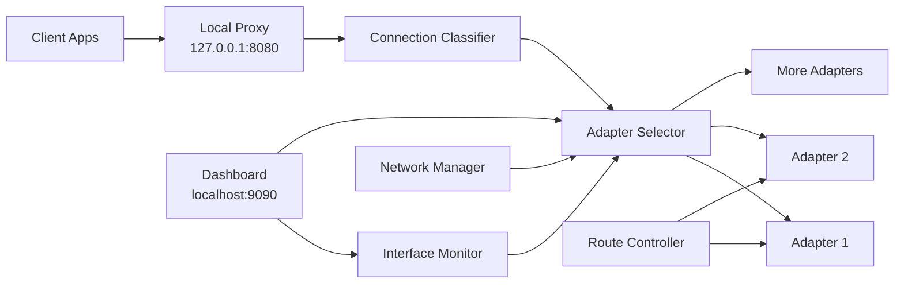

<div align="center">

<h1>NetFusion</h1>

**Windows multi-interface traffic orchestration for real-world multi-connection workloads**

[](./LICENSE)
[](https://github.com/LoRdGrIm2035/NetFusion/commits)
[](https://github.com/LoRdGrIm2035/NetFusion)
[](https://github.com/LoRdGrIm2035/NetFusion)
[](https://www.microsoft.com/windows)
[](https://learn.microsoft.com/powershell/)
[](#quick-start)
[](#quick-start)

</div>

---

## Why NetFusion Exists

NetFusion is a local Windows traffic orchestrator written in PowerShell. It runs a local proxy, watches multiple network adapters, scores their health, and binds each new outbound connection to the interface that makes the most sense at that moment.

The result is practical multi-adapter utilization for workloads that already use many parallel TCP connections, such as segmented download managers, torrent clients, and bursty web-heavy applications.

> [!IMPORTANT]
> NetFusion is connection-based, not packet-bonded. It improves aggregate throughput across many connections. It does not split one TCP flow across multiple adapters.

## At A Glance

| Item | Value |
| --- | --- |
| Platform | Windows 10 or Windows 11 |
| Runtime | PowerShell 5.1 or newer |
| Local proxy | `127.0.0.1:8080` |
| Dashboard | `http://localhost:9090` |
| Best workloads | IDM, aria2, torrents, multi-request downloaders |
| Requires admin | Yes, for route, firewall, proxy, and metric changes |
| Not designed for | MPTCP, MLPPP, Layer 2 bonding, packet striping |

## What It Does And Does Not Do

| NetFusion does | NetFusion does not |
| --- | --- |
| Run a local HTTP/HTTPS proxy on `127.0.0.1:8080` | Perform true link bonding or packet striping |
| Bind new outbound sockets to a selected adapter IP | Turn every single browser download into summed bandwidth |
| Monitor adapter health using latency, jitter, and failure signals | Replace remote aggregation servers or bonding hardware |
| Keep session affinity where stability matters | Split one long-lived HTTPS tunnel live across adapters |
| Expose live telemetry on `http://localhost:9090` | Guarantee doubled internet speed when both adapters share one WAN bottleneck |

If both adapters ultimately reach the internet through the same router or same constrained WAN path, that upstream bottleneck still wins.

## Architecture



### Core runtime path

1. A local app sends traffic to the NetFusion proxy.
2. The proxy classifies the connection and chooses an adapter.
3. NetFusion binds the outbound socket to that adapter's local IPv4 address.
4. Health data, retries, and session affinity influence later decisions.
5. The dashboard exposes the resulting state for live inspection.

## Quick Start

### 1. Verify both adapters are usable

Make sure each adapter has:

- an IPv4 address
- a working gateway
- actual internet reachability

Useful checks:

```powershell
Get-NetAdapter | Where-Object Status -eq 'Up'
Get-NetIPAddress -AddressFamily IPv4
Get-NetRoute -DestinationPrefix '0.0.0.0/0'
```

### 2. Start NetFusion as Administrator

```powershell
.\NetFusion-START.bat
```

### 3. Open the dashboard

```text
http://localhost:9090
```

### 4. Point supported apps to the local proxy

Use:

- host: `127.0.0.1`
- port: `8080`

This matters most for apps that can open many parallel connections.

## Best-Case Use Cases

NetFusion shines when the application already behaves like a multi-stream client:

- segmented download managers such as IDM or `aria2`
- torrent clients
- multi-request API fetchers
- mixed browsing and downloading where many concurrent TCP sessions exist

It is a poor benchmark target for a single browser download over one long-lived connection.

## Repository Map

| Area | Purpose |
| --- | --- |
| `NetFusion-START.bat`, `NetFusion-STOP.bat`, `NetFusion-SAFE.bat` | Start, stop, and emergency cleanup entry points |
| `core/` | Engine, proxy, routing, health monitoring, learning, watchdog, cleanup |
| `dashboard/` | Local telemetry UI and dashboard server |
| `config/config.default.json` | Default runtime configuration shipped with the repo |
| `test-*.ps1` and `fix-*.ps1` | Diagnostics, throughput validation, and recovery helpers |

<details>
<summary><strong>Expanded module overview</strong></summary>

| File | Role |
| --- | --- |
| `core/NetFusionEngine.ps1` | Main orchestrator that coordinates proxy, monitoring, and maintenance loops |
| `core/SmartProxy.ps1` | Local HTTP/HTTPS proxy that binds outbound sockets to selected adapter IPs |
| `core/NetworkManager.ps1` | Adapter discovery, capability inspection, and interface inventory generation |
| `core/InterfaceMonitor.ps1` | Health scoring using latency, jitter, failures, and live activity signals |
| `core/RouteController.ps1` | Interface metric management and optional split-route behavior |
| `core/QuicBlocker.ps1` | Forces browser traffic toward TCP by blocking UDP 443 where configured |
| `core/LearningEngine.ps1` | Learns from prior decisions and supports recommendation logic |
| `dashboard/DashboardServer.ps1` | Serves dashboard data on `localhost:9090` |

</details>

## Configuration Highlights

`config/config.default.json` ships the default behavior. Runtime-generated state such as `config/health.json`, `config/interfaces.json`, and `config/proxy-stats.json` is intentionally ignored by Git.

| Key | Default | Why it matters |
| --- | --- | --- |
| `mode` | `maxspeed` | Sets the high-level strategy profile |
| `proxyPort` | `8080` | Local proxy listen port |
| `dashboardPort` | `9090` | Dashboard server port |
| `blockQUICOnSecondaryAdapters` | `true` | Helps browsers fall back to TCP paths the proxy can manage |
| `routing.splitRoutesEnabled` | `false` | Route splitting is optional and secondary to proxy distribution |
| `proxy.sessionAffinityTTL` | `300` | Keeps related requests sticky long enough for stability |
| `telemetry.enabled` | `true` | Enables decision and health visibility |

## Validation Workflow

### Check actual adapter use

Do not trust application-level speed numbers alone. Check whether multiple adapters are truly moving traffic:

```powershell
Get-NetAdapterStatistics -Name 'Wi-Fi 3'
Get-NetAdapterStatistics -Name 'Wi-Fi 4'
```

### Run the combined-speed validator

```powershell
powershell -ExecutionPolicy Bypass -File .\test-combined-speed.ps1
```

Interpret the results carefully:

- strong direct adapter-bound tests plus weak proxy aggregation means the distribution path needs investigation
- weak direct adapter-bound results on one interface means that link itself is the problem
- strong multi-connection proxy results plus weak single browser downloads is expected for this architecture

### Compare runtime state files

Use generated telemetry for ground truth:

- `config/interfaces.json`
- `config/health.json`
- `config/proxy-stats.json`
- `config/decisions.json`
- `logs/events.json`

## Troubleshooting

<details>
<summary><strong>Only one adapter carries traffic</strong></summary>

Check that:

- the second adapter has a valid IPv4 address
- the second adapter has a default route
- the application is actually using the local proxy
- the workload opens multiple concurrent connections
- the adapter is not stuck on an APIPA address such as `169.254.x.x`

</details>

<details>
<summary><strong>You expected summed bandwidth from one browser download</strong></summary>

That expectation does not match the current design. Browsers often reuse a small number of HTTPS connections, and NetFusion distributes per connection, not per packet.

</details>

<details>
<summary><strong>Browser traffic is not balancing well</strong></summary>

Check whether:

- QUIC blocking is enabled where needed
- the browser is actually using the configured proxy
- the traffic pattern contains enough parallel TCP connections to distribute

</details>

<details>
<summary><strong>An adapter has no gateway or falls back to APIPA</strong></summary>

Use the recovery helpers:

- `test-wifi4-fix.ps1`
- `fix-wifi4.ps1`
- `fix-wifi4-arp.ps1`

Then re-check:

```powershell
Get-NetIPAddress -InterfaceAlias 'Wi-Fi 4' -AddressFamily IPv4
Get-NetRoute -InterfaceAlias 'Wi-Fi 4' -DestinationPrefix '0.0.0.0/0'
```

</details>

## Known Limits

- NetFusion is not a replacement for true bonding hardware.
- A single transfer can remain limited by one interface.
- Session affinity intentionally reduces spreading for some traffic classes.
- USB Wi-Fi adapters may be less stable than internal or wired adapters.
- Link speed shown by Windows is not guaranteed internet throughput.

## Author

LoRdGrIm2035 (https://github.com/LoRdGrIm2035)

## Contibuters

Arman Khan

## License

This project is licensed under the [MIT License](./LICENSE).
